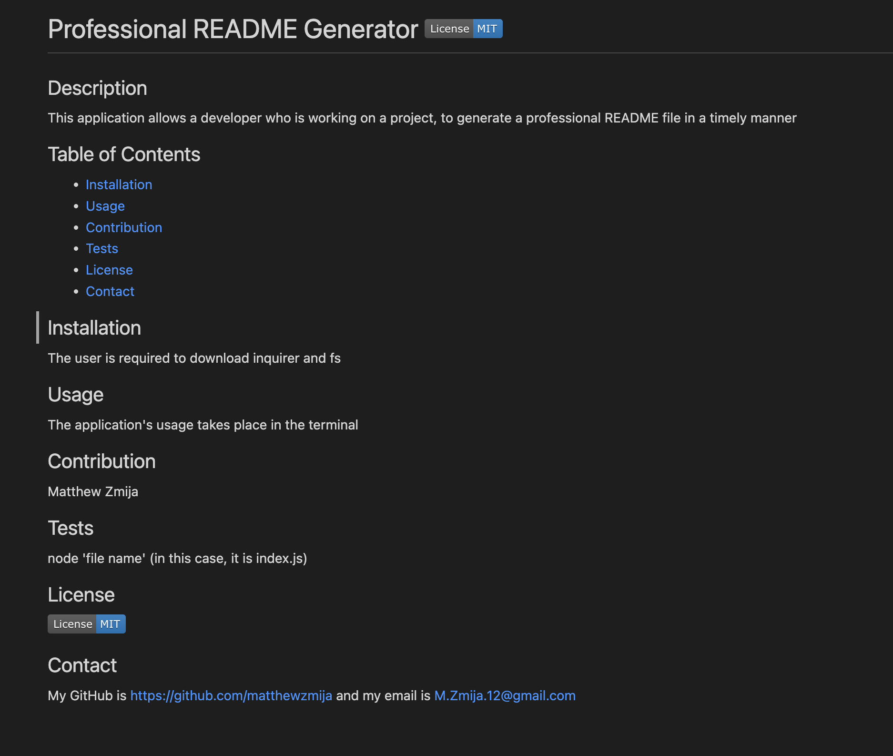

# Professional-README-File-Generator

## Description

The task at hand was to create a command-line application that dynamically generates a professional README file from a user's input using the Inquirer package. This project was built to save developers precious time in quickly creating a presentable README file that fulfills the standard criteria. This is achieved by prompting the developer to answer a series of questions so that the file can be structured accordingly.

## Usage

The objectives that were completed to fulfill in creating a professional README file generator are as follows...

- Created prompts for the user to answer where the generator could correctly structure the file
- After the prompts have been completed, display a sleek README.md file that includes the title of the project and sections entitled Description, Table of Contents, Installation, Usage, License, Contributing, and Tests
- Displayed the badge of the license that was used in both the Title and License sections respectively
- Ensured that both the Table of Contents and Contact section had responsive links

## Screenshot

## URL of GitHub repository

https://github.com/matthewzmija/Professional-README-File-Generator

## License

N/A
